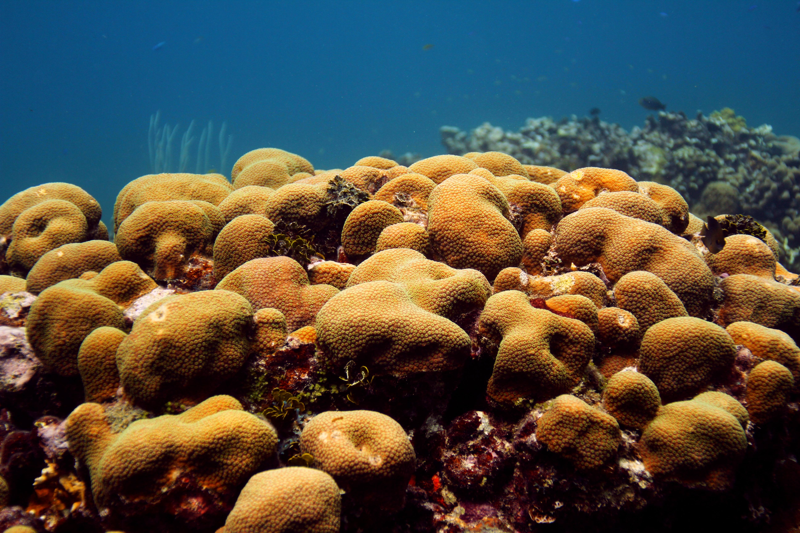
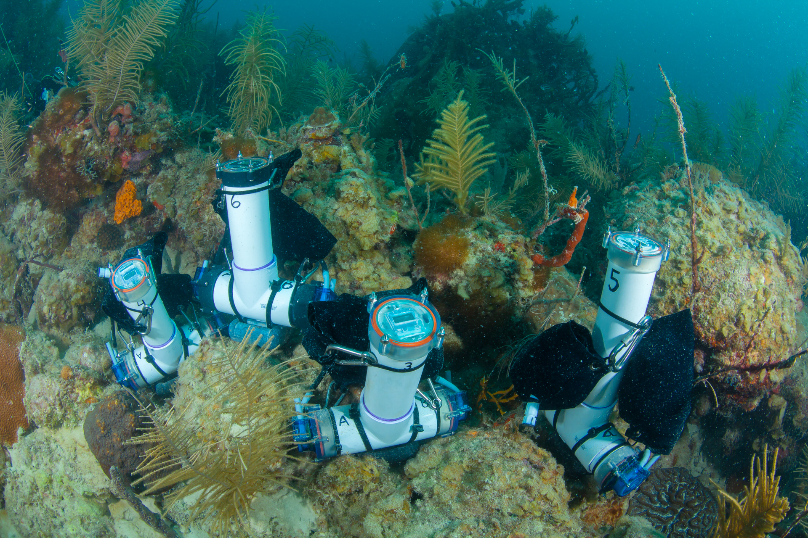
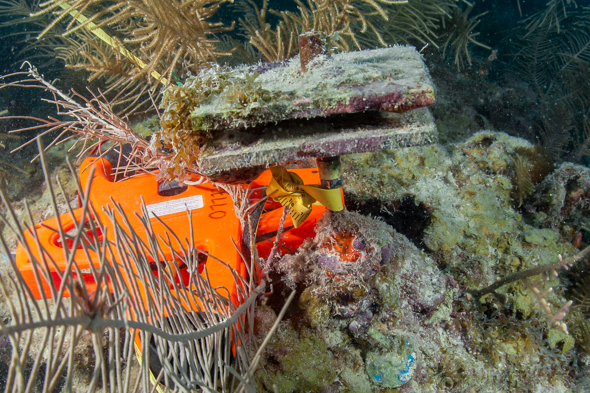
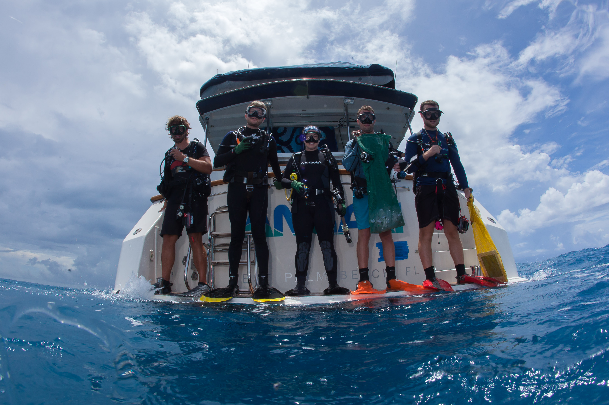

---
output:
  word_document: default
  always_allow_html: true
  html_document:
    fig_height: 5
    fig_width: 5
    fig_position: center
editor_options: 
  chunk_output_type: console
---

<h1 style="color: darkblue;font size=24, align=center" > National Coral Reef Monitoring Program</h1> 

<h2 style="color: darkblue;font size=12"> Climate Monitoring Brief: Flower Garden Banks National Marine Sanctuary</h2>
--------


```{r setup, include=FALSE}
knitr::opts_chunk$set(echo = FALSE,
                message = FALSE, warning = FALSE, 
                fig.align = "center")
options(htmltools.dir.version = FALSE)
```

 
```{r libraries, include=FALSE}
library(dplyr)
library(reshape)
library(tidyverse)
library(lubridate)
library(stringr)
library(fs)

library(plotly)
library(scales)
library(ggpubr)
library(RColorBrewer)
library(scales)
library(openair)
library(magick)
library(ggplot2)
library(cowplot)

library(knitr)

# Map
library(leaflet)

# Dynamic html to static
#install.packages("webshot")
library(webshot)
#webshot::install_phantomjs()
#library(PhantomJS)
```


```{r front, echo=FALSE, out.width = '75%', fig.cap="Orbicella faveolata in St. Croix, USVI", fig.align='center'}



```

<br>

<h4 style="font size=8">
Atlantic Oceanographic &amp; Meteorological Laboratory Coral Program<br>
University of Miami Cooperative Institute of Marine and Atmospheric Science<br>
National Oceanic Atmospheric Administration</h4>

<br>

<h5 style="font size=6">
N. Besemer, A. Palacio, A. Webb, I. Enochs - December 2022
</h5>

```{r logos, echo=FALSE, fig.align='left', out.width='20%'}
p1 <- ggdraw() + draw_image("Logos/AOML.jpg", scale = 1)
p2 <- ggdraw() + draw_image("Logos/CIMAS.png", scale = 0.9)

plot_grid(p1, p2)
```

 
--------

### Mission

The AOML Coral Program tracks the status and trends of coral reef ecosystems of the U.S. Atlantic and Caribbean as part of the National Coral Reef Monitoring Program (NCRMP). This summary brief provides an overview of the most recent climate monitoring efforts at Flower Garden Banks National Marine Sanctuary (FGBNMS).


### Expedition summary

* The AOML Coral Program conducted NCRMP climate monitoring operations at FGBNMS from October 3rd to October 8th, 2022
* A total of eight different sites were visited by ten team members and sanctuary collaborators completing a total of 98 dives. 

--------

### Data collection summary

```{r get Temp, include=FALSE}
# 1. Import all processed temperature data
read_plus <- function(flnm) {
  read_csv(flnm ) %>%
    mutate(filename = flnm)
}

tbl_with_sources <-
    list.files(pattern = "*.csv", 
               full.names = T) %>% 
    map_df(~read_plus(.))

STR_all <-
    list.files(path = "Data/STRs",
               pattern = "*.csv", 
               full.names = T, 
               recursive = TRUE) %>% 
    map_df(~read_plus(.)) 


STR_all <- STR_all %>%
      mutate_at("filename", str_replace, "Data/STRs/FGB_", "")

colmn<-c("Transect", "Depth", "SN")
STR_all <-
  tidyr::separate(
    data = STR_all,
    col = filename,
    sep = "_",
    into = colmn,
    remove = TRUE
  )


## Formatting
summary(STR_all$Depth)
STR_all$Depth<-as.factor(STR_all$Depth)
STR_all$Depth[STR_all$Depth=="21m"]<-"21m"
STR_all$Depth[STR_all$Depth=="24m"]<-"25m" # 24m changed to 25 to plot easier
STR_all$Depth[STR_all$Depth=="27m"]<-"25m" # 27m changed to 25 to plot easier
STR_all$Depth[STR_all$Depth=="33m"]<-"30m" # 27m changed to 30 to plot easier
STR_all$Depth[STR_all$Depth=="38m"]<-"35m" # 38m changed to 35 to plot easier
STR_all$Depth<-factor(STR_all$Depth, 
                levels = c("21m", "25m", "30m","35m"))
summary(STR_all$Depth)


STR_all$Transect[STR_all$Transect=="east"]<-"East"
STR_all$Transect[STR_all$Transect=="west"]<-"West"

STR_all$Transect<-factor(STR_all$Transect, 
                levels = c("East","West"))
summary(STR_all$Transect)
```

**Subsurface temperature** 
Subsurface temperature recorders (STRs) were recovered and redeployed at east and west bank transects, each one composed by 4 depths (Fig. 1). In total,  more than 4 million temperature observations were collected (Table 1)
  
```{r Temp observations}
Cases_Loc_depth<-STR_all %>% count(Depth, Transect,
                                  sort = FALSE)
Cases_Loc_depth<-as.data.frame(Cases_Loc_depth %>%
                   pivot_wider(names_from = Depth,
                   values_from = n))
Cases_Loc_depth$Total<-rowSums(Cases_Loc_depth[, c(2:5)], na.rm=TRUE)
#write.csv(Cases_Loc_depth, "FLK_results/0_SampleS_Region_zone.csv")

kable(Cases_Loc_depth,
      format.args = list(big.mark = ","),
      caption = "Table 1: Number of temperature observations collected by transect and depth. Sites marked with NA were not sucessfully recovered")
```


```{r pH_and_temp_data, include=FALSE}

# 1.Get the pH data
pH <- read.csv('Data/seafet-sn2114-fgb-temporal-suite.csv')
summary(pH)
head(pH)

pH <- read_csv('Data/seafet-sn2114-fgb-temporal-suite.csv',col_types = cols()) %>%
    select(DateTime = `DateTime (UTC+00:00)`,
           #pH = `Internal pH (pH)`,
           pH = `2114-Int-pH`,
           
           #Temperature = `pH Temperature (Celsius)`) %>%
           Temperature = `2114-Temp`) %>%
    mutate(DateTime = parse_date_time(DateTime, '%m/%d/%y %H:%M')) %>%
    #manual start/stop time of monitoring
    #filter(DateTime >= as.POSIXct('2022-10-04 15:00:00', tz='UTC') &
    #     DateTime <= as.POSIXct('2022-10-07 14:00:00', tz='UTC')) %>%
    mutate(DateTime = with_tz(DateTime, 'America/Chicago'))

```


```{r Current_data, include=FALSE}
# 2. Get current data
fileAny <- "Data/tilt-sn2102062-fgb-suite.csv"
  # Are there going to be more than one current file? 
  current <- read.csv(fileAny, header = TRUE)
  summary(current)
  head(current)

  # current$date = ymd_hms(paste0(current$Date, current$Time), tz = "UTC")
  current$date = ymd_hms(current$DateTime, tz = "UTC")
  current <- current[, c("date","Speed..cm.s.","Heading..degrees.")]
  colnames(current) <- c("date","ws","wd")
  #manual start/stop time of monitoring
  current$DateTime<-NA
  current <- subset(current, date >= ymd_hms("2022-10-04 14:00:00") &
                    date <= ymd_hms("2022-10-07 14:00:00"))
  current$DateTime <- lubridate::with_tz(current$date,
                                         "America/Chicago")
  
  summary(current$DateTime )
  summary(current)

```

```{r PAR_data, include = FALSE}
# 3. Get the PAR data  
  light <- read_csv('Data/ecopar-sn5953-fgb-temporal-suite.csv',
                    col_types = cols()) %>%
          #mutate(DateTime = parse_date_time(DateTime, '%m/%d/%Y %H:%M:%S')) %>%
          mutate(DateTime = mdy_hms(`Datetime (CDT)`, tz="America/Chicago")) %>%
          select(DateTime, `PAR (calc)`) %>%
          drop_na() %>%
          mutate(interval = 0:(nrow(.)-1) %/% 10) %>%
          group_by(interval) %>%
          summarise(DateTime = mean(DateTime),
                    PAR = mean(`PAR (calc)`),
                    sd = sd(`PAR (calc)`)) %>%
        select(-interval) %>%
  #manual start/stop time of monitoring
   filter(DateTime >= as.POSIXct('2022-10-04 09:00:00', tz='America/Chicago') &
          DateTime <= as.POSIXct('2022-10-07 09:00:00', tz='America/Chicago'))

summary(light$DateTime)

```

```{r}
pH_count<-paste0("pH = ", nrow(pH), " observatons")
#pH_count
current_count<-paste0("Current = ", nrow(current), " observatons")
#current_count
light_count<-paste0("Light = ", nrow(light), " observatons")
#light_count
```

**NCRMP Climate Fixed Sentinel Site Monitoring**

At our East Buoy 3, 15m site, located on the East Bank, short term instruments (72h) were deployed to  monitor daily fluctuations in: 

 * **Current**: 284 observations
 * **pH**: 285 observations
 * **Light**: 288 observations
 * **Carbonate chemistry**: 21 samples collected
 

<br>
**Habitat persistence**

Changes in Bioerosion and accretion were monitored

 * **Carbonate budget surveys**: Benthic cover, sponge, urchin and parrotfish surveys completed at 6 transects
 
 * **Bioerosion**: 14 Bioerosion Monitoring Units (BMUs) collected, 15 redeployed 
 
 * **Calcification**: 5 Calcification Accretions Units (CAUs) collected, 5 redeployed
 
 * **Benthic cover**: 6 landscape mosaics 
 


<br>

```{r mapInfo, include=FALSE, fig.align='center'}
# Map information

# Add info from the sampling stations
stations <- as.data.frame(read.csv(textConnection("
Site,	Lat,	Lon
East Buoy 3 shallow,	27.90685,	-93.59923
East Bank Deep STRs,	27.90860,	-93.59718
West Bank STRs,	27.87617,	-93.81405")))
stations$Site<-as.character(stations$Site)
#stations$Depth<-as.character(stations$Depth)
stations$Site<-factor(stations$Site, levels = c("East Buoy 3 shallow",
                                                "East Bank Deep STRs",
                                                "West Bank STRs"))
#stations$Depth<-ordered(stations$Depth, levels = c("-1m", "0m", "1m","5m", "15m","25m"))
#summary(stations)
kable(head(stations, format = "html"))

# #summary(stations)
# # Change color depending on type of data?
# 
#   # Create palette 
#   #brewer.pal(n = 9, name = "Blues")
#   #library(RColorBrewer)
#   #my_blues <- c(brewer.pal(9, "Blues")[c(4,5,6,7,8, 9)])
#   
#   # Assigne it to Depth and locations
#   pal.gen <- colorFactor(palette = "Blues",
#                          domain = stations$Depth)
#   brewer.pal(n=8, "Blues")
# 
 pal.gen2 <- colorFactor(palette = "Blues",
                        domain = stations$Site)
# # Noth arrow
#   #North <- "Data/North-Arrow.png"
#   
#   myicon <- makeIcon( iconUrl = "Data/North-Arrow.png", 
#                     iconWidth=30,
#                     iconHeight=30)

```

```{r makeAmap1, echo=FALSE, fig.width = 5, fig.height = 6, fig.align='center'}
map1<-leaflet(stations, width = '600px') %>%
  addTiles() %>%
  #addProviderTiles(providers$Esri.WorldGrayCanvas) %>%

  # addLegend(position = "bottomright",
  #           pal = pal.gen2,
  #           values = ~Site, opacity = 1) %>%
  addScaleBar(position = "bottomright") %>%

  fitBounds(lng1=-94.5, lat=29.80, lng2=-93.0, lat2=27.7)%>%

addCircleMarkers(lng = ~Lon, lat = ~Lat,
                   stroke = T,
                   fillOpacity = 0.8,
                   radius = 4)
map1


# addControl(map, position="topright",
#           html = '')

  
```

```{r makeAmap, echo=FALSE, fig.width = 10, fig.height = 3.7, fig.align='center'}
map<-leaflet(stations, width = '700px') %>%
  addTiles() %>%
  #addProviderTiles(providers$Esri.WorldGrayCanvas) %>%

  # addLegend(position = "bottomright",
  #           pal = pal.gen2,
  #           values = ~Site, opacity = 1) %>%
  addScaleBar(position = "bottomright") %>%

  fitBounds(lng1=-93.815, lat=27.85, lng2=-93.54, lat2=27.91)%>%

addCircleMarkers(lng = ~Lon, lat = ~Lat,
                   stroke = T,
                   fillOpacity = 0.8,
                   radius = 5,
                   #color = ~pal.gen(Site),
                   label = ~Site,
                   labelOptions = labelOptions(
                     noHide = T,
                     direction = "bottom",
                     textOnly = TRUE,
                     style = list(
        "color" = "black")))
map


# addControl(map, position="topright",
#           html = '')

  
```

<font size="2"> **Figure 1:** Study sites and depths in Flower Garden Banks </font>

-----

#### Subsurface Temperature

The temperatures that marine organisms experience are a function of depth and local oceanographic conditions. To monitor this, two cross-shelf transects were established at each bank within the sanctuary. Four years of temperature measurements were retrieved at the East bank (4 depths) and seven at the West bank (3 depths, Fig. 2). Temperature was measured using SeaBird Electronics Subsurface Temperature Recorders (STR)s that collected data at 5-minute intervals. The STRs from west bank were not able to be collected during the last field monitoring trip in 2019. We have included the entire temperature data collection from east bank for better comparison to west bank.MORE TO THIS.


```{r filter Temp, include=FALSE}
toDelete <- seq(1, nrow(STR_all), 2)
STR_all<-STR_all[ toDelete ,]

toDelete <- seq(1, nrow(STR_all), 2)
STR_all<-STR_all[ toDelete ,]
```

```{r Tempvariables, include=FALSE}
# 3. Define limits for temperature and time (if we want to follow Mike's to automate)
  globalMinDate <- min(STR_all$UTCDateTime)
  globalMinTemp <- min(STR_all$Temperature)
  globalMaxDate <- max(STR_all$UTCDateTime)
  globalMaxTemp <- max(STR_all$Temperature)

# 4. Define breaks in the x axis
  if ((globalMaxDate-globalMinDate) > 365.25) {
    xWidth <- "12 months"
  } else {
    xWidth <- "2 months"
  }

```

```{r plot STR temperature, echo=FALSE, fig.width = 9.5, fig.height = 4}
plot1<-ggplot(data = STR_all) +
      geom_line(aes(x = ymd_hms(UTCDateTime), 
                    y = Temperature, colour=Depth),
                size=0.3) +
  
  theme_bw() +
  theme(#axis.title.x = element_blank(),
        panel.grid = element_blank(),
        legend.position = c(0.5, 0.95),
        #legend.position = c(0.5, 0.05) ,
        legend.direction = "horizontal" ,
        plot.margin = unit(c(5.5, 5.5, 5.5, 5.5), "points"),
        legend.title = element_blank(),
        #legend.box.background = element_rect(colour = "black")
        ) +
  #scale_color_brewer(palette="Blues")+
  scale_color_manual(values=c("#DEEBF7", "#9ECAE1", "#4292C6","#084594"))+

  scale_x_datetime(breaks = breaks_width(xWidth),
                   labels = date_format("%m/%Y"),
                   #limits = c(globalMinDate, globalMaxDate),
                   name="Date") +
  scale_y_continuous(limits = c(globalMinTemp, globalMaxTemp+1.5),
                     name=(expression(paste("Temperature (", 
                                            degree, "C)"))),
                     breaks = seq(0,50,2.5)) +
  guides(colour = guide_legend(override.aes = list(size = 8)))+
  theme(legend.key=element_rect(fill=NA)) +
  facet_grid(Transect~.)
  #facet_wrap(~Transect, ncol=1, scales = "free_x")
#plot1

box1 <- ggplot(data = STR_all) +
       geom_boxplot(aes(x = Depth, y = Temperature, fill=Depth)) +
       theme_bw() +
       theme(panel.grid = element_blank(),
             axis.text.y = element_blank(),
             #axis.title.x = element_blank(),
             axis.title.y = element_blank(),
             legend.position = "none")+
      
  scale_y_continuous(limits = c(globalMinTemp, globalMaxTemp+1.5),
                     breaks = seq(0,50,2.5))+
  #scale_fill_brewer(palette="Blues")+
  scale_fill_manual(values=c("#DEEBF7", "#9ECAE1", "#4292C6","#084594"))+
  facet_grid(Transect~.)
#box1

Figure2_1 <- ggarrange(plot1, box1, widths = c(8/10, 2/10))

```

```{r, echo = F, fig.width = 9.5, fig.height = 6}
Figure2_1
```

<font size="2"> **Figure 2:** Temperature conditions at two transects in FGBNMS (east bank, and west bank) representing a depth gradient (21m, 25m, 30 and 35m). Data were collected from September 2015 to October 2022. However, STR from west Bank - 15m was not recovered. </font>
 
```{r, echo = F, include=F}
#Temp.Depth <- plyr::ddply (str_all, .(Depth), summarise,
#                Tmin = min (Temperature, na.rm = F), 
#                Tmax = max (Temperature, na.rm = F),
#                Tmean = mean (Temperature, na.rm = F), 
#                Tsd = sd (Temperature, na.rm = F))
#kable(as.data.frame(Temp.Depth, format = "markdown"))

head(STR_all)

STR_all$MonthYear<-format(STR_all$UTCDateTime, format="%Y-%m")
STR_all$Month<-format(STR_all$UTCDateTime, format="%m")

STR_all_summary <- STR_all %>%
  group_by(MonthYear, Depth, Transect) %>%
  summarise(
    MeanT = mean(Temperature, na.rm = T),
    MinT = min(Temperature, na.rm = T),
    MaxT = max(Temperature, na.rm = T)
  ) %>%
  arrange(MonthYear)
STR_all_summary

STR_all_summary <- STR_all %>%
  group_by(Depth, Transect) %>%
  summarise(
    MinD = min(UTCDateTime, na.rm = T),
    MaxD = max(UTCDateTime, na.rm = T)
  ) %>%
  arrange(Transect)
STR_all_summary

```

Temperature values were lower in the deeper stations (30 and 35m) of both east and west banks. A particular cold winter was recorded in the year 2021, when monthly mean temperatures were below 20.6$^\circ$C at all depths. September of 2016 was the hottest month recorded in both banks, with mean temperatures higher than 30.76$^\circ$C) at the 21, 25 and 30m stations, and higher than 29.77$^\circ$C) at the 35m stations (Fig. 2).

-----

#### Diurnal Suite Deployment

Seawater carbonate chemistry can fluctuate diurnally, due to biological forcing and processes such as photosynthesis and respiration, as well as calcification and dissolution. To characterize this, a suite of instruments were deployed for a 72-hour period at the East Bank 15m site, East Buoy 3 (Fig. 3). A SeaFET was used to log pH, an EcoPAR measured Photosynthetically Active Radiation (PAR), and a Lowell Tiltmeter measured current speed and direction. Each collected measurements at 15-minute intervals.


To accompany and validate the diurnal suite, discrete water samples were collected at three-hour intervals (n=21) using Subsurface Automatic Samplers (SAS, https://www.coral.noaa.gov/accrete/sas/). These samples will be analyzed for Total Alkalinity (TA), Dissolved Inorganic Carbon (DIC), and Spectrophotometric pH (SpecpH). Using these metrics, we can get the calculated values for pCO2 and aragonite saturation state which provide the full suite of carbonate chemistry parameters.


```{r ph and temp combined v3,echo=FALSE, warning=FALSE,fig.width = 9.5, fig.height = 3.5}

#pH and temp combined 

# Scale Temperature 
  pH$Temp.adj <- (pH$Temperature * 0.110) + 4.820
  
   # scaleFactor_T <- max(pH$pH) / max(pH$Temperature)
   # pH$Temp.adj<-(pH$Temperature * scaleFactor_T)
   # summary(pH)

  pH_max <- max(pH$pH)
  
# Plot
pH_Temp_Plot<-ggplot(data = pH) +
  # Day/Night
  # Day/Night
  annotate("rect",
          xmin = seq.POSIXt(as.POSIXct('2022-10-04 19:01:00', tz='America/Chicago'),
                         by = "day", length.out = 3),
          xmax = seq.POSIXt(as.POSIXct('2022-10-05 07:14:00', tz='America/Chicago'),
                         by = "day", length.out = 3),
          ymin = -Inf, ymax = Inf,
          fill="grey", alpha=0.5) +
  
   annotate("text",
          label = paste("Oct", 04:06),
          x = seq.POSIXt(as.POSIXct('2022-10-04 12:00:00', tz='America/Chicago'),
                         by = "day", length.out = 3),
          y = pH_max+0.015)+ 
  # Data
  geom_line(aes(x=DateTime, y=Temp.adj, color = "Temperature"),
            size=0.8) +
  geom_line(aes(x=DateTime, y=pH, color = "pH"),
            size=0.8) +
  scale_color_manual(values=c("black", "red"))+
  # Axes
  scale_y_continuous(limits = c(7.89, 8.02),
                     name="pH (Total scale)",
                     sec.axis = sec_axis(~(.-4.820)/0.110,
                                name="Temperature (\u00B0C)"))  +
  scale_x_datetime(name="Date and Time (CDT)",
                  date_breaks = "6 hour",
                  #date_minor_breaks = "1 hour",
                  labels = date_format("%m/%d\n%H:%M",
                                        tz="America/Chicago"))+
  coord_cartesian(ylim = c(7.89, 8.02),
                  xlim = c(min(pH$DateTime),max(pH$DateTime)),
                  clip = 'off',
                  expand = T) +
  #Aesthetics
  theme_bw() +
  theme(#axis.text.x = element_text(angle = 0, hjust = 0.5),
        plot.margin = unit(c(1,1,0.5,1), "lines"),
        legend.position = "none",
        panel.grid = element_blank(),
        axis.title.x=element_blank(), 
        axis.text.x=element_blank(),
        legend.key=element_rect(fill=NA), axis.title.y.right = element_text(vjust = .75))+
  guides(colour = guide_legend(override.aes = list(size = 8)))

#pH_Temp_Plot
 
```

```{r light and current combined,echo=FALSE, warning=FALSE,fig.width = 9.5, fig.height = 3.5}

# Scale current
scaleFactor <- max(light$PAR) / max(current$ws)
current$ws.adj<-(current$ws * scaleFactor)

# Plot
Light_Current<-ggplot(data = light) +

  # Day/Night
 annotate("rect",
          xmin = seq.POSIXt(as.POSIXct('2022-10-04 19:01:00', tz='America/Chicago'),
                         by = "day", length.out = 3),
          xmax = seq.POSIXt(as.POSIXct('2022-10-05 07:14:00', tz='America/Chicago'),
                         by = "day", length.out = 3),
          ymin = -Inf, ymax = Inf,
          fill="grey", alpha=0.5) +
  
  # Data
  geom_line(data= current, aes(x=date, y=ws.adj, color = "Current Speed"),
            size=0.8) +
  geom_line(aes(x=DateTime, y=PAR, color = "PAR"),
            size=0.8) +
  scale_color_manual(values=c("navyblue", "goldenrod1"))+
  
  # Axes
  scale_y_continuous(limits = c(0,430), 
                     name=expression(paste("PAR (",mu,"mol photons m"^-2,"s"^-1,")")),
                     sec.axis = sec_axis(~./scaleFactor, 
                                name="Current Speed (cm/s)",
                                breaks = seq(1,12,2)))+
                       
  scale_x_datetime(name="Date and Time (CDT)",
                   date_breaks = "6 hour",
                   #date_minor_breaks = "1 hour",
                   labels = date_format("%m/%d\n%H:%M",
                                        tz="America/Chicago")) +

  coord_cartesian(ylim = c(0,430),
                  xlim = c(min(light$DateTime),max(light$DateTime)),
                  clip = 'off',
                  expand = T) +
  
  #Aesthetics
  theme_bw() +
  theme(axis.text.x = element_text(angle = 0, hjust = 0.5),
          plot.margin = unit(c(0.5,1,0.1,1), "lines"),
          legend.position = "none",
          panel.grid = element_blank(),
        legend.key=element_rect(fill=NA)
        )+
  guides(colour = guide_legend(override.aes = list(size = 8)))
#Light_Current

```


```{r Diurnal_Suite_Plot, echo=FALSE, warning=FALSE, fig.width = 9.5, fig.height = 7}
Legend1<-pH_Temp_Plot + theme(legend.position = "bottom",
                              legend.title = element_blank())
  Legend1<-get_legend(Legend1)
  #ggdraw(Legend1)

Legend2<-Light_Current + theme(legend.position = "bottom",
                              legend.title = element_blank())
  Legend2<-get_legend(Legend2)
  #ggdraw(Legend2)
  
ggdraw(plot_grid(plot_grid(pH_Temp_Plot,
                           Light_Current,
                           ncol=1, align='v', 
                           rel_heights = c(0.9, 1)),
                 plot_grid(Legend1, Legend2, ncol=2), 
                 ncol = 1, rel_heights=c(1, 0.1)))
```

<font size="2">**Figure 3:** Data from East Buoy 3 diurnal suite monitoring from October 4th to Oct 7th. Top panel: pH and temperature from SeaFET. Bottom panel: Photosynthetically Available Radiation (PAR) and current speed from EcoPAR and Tiltmeter. Grey blocks denote night time throughout sequence of the plot. Instruments measured parameters every 15 minutes.</font>


```{r SASs, echo=FALSE, out.width = '50%', fig.cap="Figure 4: Submered Automated Samplers (SAS) deployed to collect water samples every 3 hours", fig.align='center'}



```

-----

#### Habitat persistence

**Carbonate budget** assessments use transect-based surveys to quantify the abundance of carbonate producers, such as corals and crustose coralline algae, as well as carbonate bioeroders, such as grazing parrotfish and sea urchins. Abundances are multiplied by taxon- specific rates of carboante alteration to determine if a reef is in a state of net accretion (habitat growth) or net loss (habitat loss). At East Buoy 3, six transects were established and surveyed in 2015 to obtain carbonate budgets. We revisited this site in 2019 and 2022 to find out the new status of carbonate budget after six years. The transect results showed that carbonate budgets have decreased in 2022. This trend is driven by a reduction in coral cover and calcification as well as a steep increase in parrotfish erosion. MORE SUMMAITON TEXT FOR FGB CARB BUDGETS


```{r, Carbonate_B_plot, echo=FALSE, warning=FALSE, fig.width = 7.5, fig.height = 3.5}
## boxplots production
data <- read.csv("Data/FGB_CB.csv")
mdata<-melt(data,id.vars=c(8:13))

mdata$Year<-as.character(mdata$Year)
mdata[c(7)] <- lapply(mdata[c(7)], gsub, pattern = ".", replacement = " ", fixed = TRUE)

CB<-subset(mdata,variable=="Carbonate budgets")

CB_A_plot<-ggplot(CB,aes(Year,value,fill=Year))+
  geom_boxplot(alpha=0.5)+
  scale_fill_manual(values=c("#330033", "#666699","#336666")) +
  facet_wrap(~variable)+
  # scale_viridis(discrete=TRUE,alpha=0.6)+
  geom_jitter(colour="black",size=1,alpha=0.9,shape=1)+
  theme_bw()+
  theme(panel.grid.major = element_blank(),
        panel.grid.minor=element_blank(),
        legend.position = "none")+
  ylab(expression(paste( " [ kg m"^"-2"," yr"^"-1","]")))


mdata<-melt(data,id.vars=c(1,8:13))
mdata$Year<-as.character(mdata$Year)
mdata[c(8)] <- lapply(mdata[c(8)], gsub, pattern = ".", replacement = " ", fixed = TRUE)
mdata$variable <- factor(mdata$variable, levels = c("Coral production","CCA production", 
                                                    "PF bioerosion", "Urchin bioerosion",
                                                    "Macro bioerosion","Micro bioerosion"))
CB_B_plot<-ggplot(mdata,aes(Year,value,fill=Year))+
  geom_boxplot(alpha=0.5)+
  scale_fill_manual(values=c("#330033", "#666699","#336666")) +
  geom_jitter(colour="black",size=1,alpha=0.9,shape=1)+
  facet_wrap(~variable,scales="free",ncol=3) +
  theme_bw()+
  theme(panel.grid.major = element_blank(),
        panel.grid.minor=element_blank(),
        legend.position = "none")+
  ylab(expression(paste( " [ kg m"^"-2"," yr"^"-1","]")))

ggarrange(CB_A_plot, CB_B_plot, 
          #labels = c("A", "B", "C"),
          ncol = 2, nrow = 1, widths = c(0.8, 2.2))
```

<font size="2">**Figure 5:** Carbonate budgets from East FGB in 2015, 2019 and 2022 and the processes contributing to calcification and bioerosion.  The horizontal line in the "Net carbonate production panel" denotes accretionary stasis, the point where the budget flips from habitat grpwth to loss. PF represents parrotfish. </font>


**Landscape mosaics** are used to quantify the benthic community, and to monitor changes in coral cover over time. Thousands of underwater images are digitally stitched together to create a high-resolution archive of the reef at the time of collection.


```{r mosaic, echo=FALSE, out.width = '50%', fig.cap="Figure 6: Landscape Mosaic collected from transect 6", fig.align='center'}

knitr::include_graphics("Data/mosaic.jpg")

```

Finally, **Calcification Accretion Units (CAUs)** and **Bioerosion Monitoring Units (BMUs)** were used to investigate the balance between calcification and erosion. CAUs and BMUs were collected and redeployed for the next sampling cycle. CAUs are processed by the Pacific Climate group and the data will be available within a year. BMUs will be dried and cleaned using a hydrogen peroxide solution. These samples will be weighed and scanned using a CT scanner and then compared to their pre-scans to quantify bioerosion. Data will be available in a year. Please reference previous datasets for more information.


```{r BMUs, echo=FALSE, out.width = '50%', fig.cap="Figure 7: CAU and BMU pair before retreval after being deployed for three years. CAUs are two parallel PVC plates to quantify settled accretors. BMU is mounted coral skeleton installed at the base of the metal stake and has been encrusted.", fig.align='center'}



```

-----

### About the monitoring program

AOML's climate monitoring is a key part of the National Coral Reef Monitoring Program of NOAA's Coral Reef Conservation Program (CRCP), providing integrated, consistent, and comparable data across U.S. Managed coral reef ecosystems.
NCRMP efforts aim to:

* Document the status of reef species of ecological and economic importance
* Track and assess changes in reef communities in response to environmental stressors or human activities
* Deliver high–quality data, data products, and tools to the coral reef conservation community


### Point of Contact

Atlantic Climate Operations Coordniator: nicole.besemer@noaa.gov

Principal Investigator: ian.enochs@noaa.gov

NCRMP Coordinator: erica.towle@noaa.gov


### For more information

Coral Reef Conservation Program: http://coralreef.noaa.gov

NCRMP climate monitoring: https://www.coris.noaa.gov/monitoring/climate.html

NOAA Atlantic Oceanographic and Meteorological Laboratory:
http://www.aoml.noaa.gov/

[FGBNMS Reef Status Report 2020](https://www.coris.noaa.gov/monitoring/status_report/docs/FGB_508_compliant.pdf)

[National Coral Reef Status Report 2020](https://repository.library.noaa.gov/view/noaa/27295)

### Acknowledgements


These efforts were jointly funded by NOAA's CRCP project #743 and OAP. We would like to sincerely thank Flower Garden Banks and  the National Marine Santuary Foundation for supporting our field efforts and assisting monitoring surveys.

```{r fundingsources, include=FALSE, fig.width = 10, fig.height = 4, fig.align='center', out.width='100%'}

F1 <- ggdraw() + draw_image("Logos/CRCP.jpeg", scale = 0.5)
#F_space<-ggplot() +
#    theme_void() +
#    geom_text(aes(0,0,label='')) +
#    xlab(NULL)
F2 <- ggdraw() + draw_image("Logos/OAP.png", scale = 1.1)
F3 <- ggdraw() + draw_image("Logos/NMSF.png", scale = 0.7)
F4 <- ggdraw() + draw_image("Logos/fgblogo.webp", scale = 0.65)

funding<-plot_grid(F1, F2, F3, F4, 
                  nrow=1, rel_widths = c(2, 2, 4, 3))

```


```{r funding, echo=FALSE, fig.width = 10, fig.height = 3, fig.align='center', out.width='100%'}

funding
```

### Our Team


```{r team, echo=FALSE, out.width = '50%', fig.align='center', fig.cap="St. Croix, USVI 2022 Field team" }


```

**AOMLs NCRMP Atlantic and Caribbean Climate Team**: I. Enochs, N. Besemer, G. Kolodziej, M. Chakraborty, A.Boyd, M. Jankulak, A. Palacio-Castro, A. Webb, B. Chomitz

**Field team support and collaborators:** M. Studivan, K. Eaton, M. Johnston, K. O'Connell

